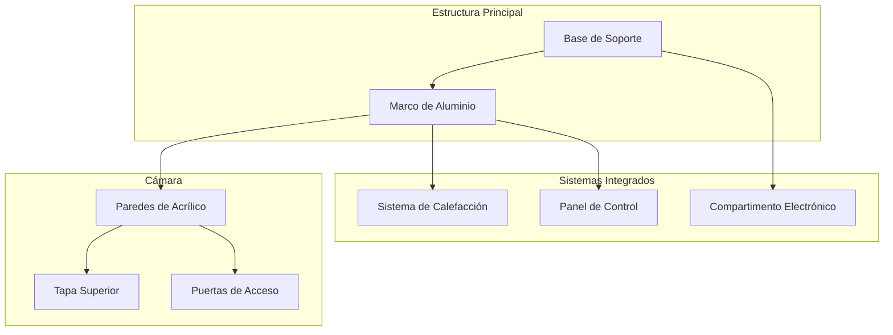

# Carcasa y Estructura

## Visión General

La estructura de IncuNest está diseñada para:

- **Aislamiento térmico** eficiente
- **Visibilidad** del paciente
- **Acceso** fácil para el personal médico
- **Facilidad de limpieza** y desinfección
- **Fabricación local** con materiales accesibles

## Dimensiones Generales

```
            ┌─────────────────────────────────────────┐
            │                                         │
            │              600mm                      │
            │◄───────────────────────────────────────►│
        ▲   ┌─────────────────────────────────────────┐
        │   │                                         │
        │   │                                         │
  500mm │   │          CÁMARA PRINCIPAL              │
        │   │                                         │
        │   │                                         │
        ▼   └─────────────────────────────────────────┘
            
            PROFUNDIDAD: 400mm
```

| Parámetro | Externo | Interno |
|-----------|---------|---------|
| Ancho | 600mm | 500mm |
| Alto | 500mm | 350mm |
| Profundidad | 400mm | 300mm |

## Materiales

### Cámara Principal

| Material | Espesor | Uso |
|----------|---------|-----|
| Acrílico transparente | 6mm | Paredes laterales y techo |
| Acrílico opaco | 6mm | Base y panel posterior |
| Silicona médica | - | Sellos y juntas |

### Base y Estructura

| Material | Alternativas | Uso |
|----------|--------------|-----|
| MDF | Madera contrachapada | Base estructural |
| Aluminio | Acero inoxidable | Marco de soporte |
| PLA/PETG | ABS | Piezas impresas 3D |

## Diseño Modular



## Vistas del Diseño

### Vista Frontal

```
┌─────────────────────────────────────────────────────────┐
│  ┌─────────────────────────────────────────────────┐    │
│  │                                                 │    │
│  │                                                 │    │
│  │            CÁMARA PRINCIPAL                     │    │
│  │              (Acrílico)                         │    │
│  │                                                 │    │
│  │                                                 │    │
│  └─────────────────────────────────────────────────┘    │
│  ┌─────────────────────────────────────────────────┐    │
│  │  [DISPLAY]     [TEMP]   [HUM]    [ALARMA]       │    │
│  │                                                 │    │
│  │     ● ● ●     36.5°C   65%      [SILENCIAR]     │    │
│  │     R G B                                       │    │
│  └─────────────────────────────────────────────────┘    │
│                        BASE                             │
└─────────────────────────────────────────────────────────┘
```

### Vista Lateral

```
┌───────────────────────────┐
│    ╔═══════════════╗      │
│    ║               ║      │
│    ║    CÁMARA     ║◄──── Tapa abatible
│    ║               ║      │
│    ╚═══════════════╝      │
│  ┌───────────────────┐    │
│  │ SISTEMA CALEFAC.  │◄─── Compartimento calefacción
│  └───────────────────┘    │
│  ┌───────────────────┐    │
│  │   ELECTRÓNICA     │◄─── Panel de control
│  └───────────────────┘    │
│          BASE             │
└───────────────────────────┘
```

## Sistema de Acceso

### Puertas Laterales

Las puertas laterales permiten acceso al paciente sin abrir completamente la cámara:

```
┌───────────────────────────────────────┐
│                                       │
│   ┌───────┐           ┌───────┐      │
│   │       │           │       │      │
│   │ PUERTA│           │PUERTA │      │
│   │  IZQ  │           │  DER  │      │
│   │       │           │       │      │
│   └───────┘           └───────┘      │
│                                       │
└───────────────────────────────────────┘

Dimensiones de puerta: 150mm x 200mm
```

### Tapa Superior

- **Apertura**: 180° hacia atrás
- **Bisagras**: Acero inoxidable con amortiguador
- **Cierre**: Imanes de neodimio
- **Sello**: Silicona perimetral

## Aislamiento Térmico

### Capas de Aislamiento

```
EXTERIOR          AISLANTE          INTERIOR
    │                │                  │
    ▼                ▼                  ▼
┌───────┐        ┌───────┐        ┌───────┐
│Acrílico│        │Espuma │        │Acrílico│
│  6mm  │        │ 10mm  │        │  3mm  │
└───────┘        └───────┘        └───────┘
```

| Capa | Material | Espesor | R-Value |
|------|----------|---------|---------|
| Externa | Acrílico | 6mm | 0.17 |
| Aislante | Poliestireno expandido | 10mm | 2.5 |
| Interna | Acrílico | 3mm | 0.08 |

## Lista de Corte de Acrílico

### Cámara Principal (6mm transparente)

| Pieza | Cantidad | Dimensiones |
|-------|----------|-------------|
| Pared frontal | 1 | 500 x 350 mm |
| Pared trasera | 1 | 500 x 350 mm |
| Pared lateral | 2 | 300 x 350 mm |
| Tapa superior | 1 | 500 x 300 mm |
| Base interior | 1 | 500 x 300 mm |

### Piezas con Cortes Especiales

| Pieza | Corte |
|-------|-------|
| Paredes laterales | Agujero circular 150mm para puertas |
| Pared trasera | Ranura 50x10mm para cables |
| Tapa superior | Bisagras |

## Ensamblaje

### Secuencia de Ensamblaje

1. **Preparar base** estructural
2. **Montar marco** de aluminio
3. **Instalar sistema** de calefacción
4. **Fijar paredes** laterales
5. **Instalar puertas** de acceso
6. **Colocar pared** frontal y trasera
7. **Montar tapa** superior
8. **Aplicar sellos** de silicona
9. **Instalar electrónica**
10. **Pruebas** de hermeticidad

### Tornillería Necesaria

| Tipo | Tamaño | Cantidad | Uso |
|------|--------|----------|-----|
| Tornillo autorroscante | M4 x 20mm | 40 | Estructura |
| Tornillo máquina | M3 x 10mm | 20 | Electrónica |
| Tuerca | M4 | 40 | Fijación |
| Arandela | M4 | 80 | Distribución carga |

## Archivos CAD

Los archivos de diseño están disponibles en:

```
hardware/
├── mechanical/
│   ├── cad/
│   │   ├── enclosure.step
│   │   ├── enclosure.f3d (Fusion 360)
│   │   └── drawings/
│   │       ├── assembly.pdf
│   │       └── parts_list.pdf
│   └── dxf/
│       ├── front_panel.dxf
│       ├── side_panel.dxf
│       └── base.dxf
```

## Próximas Secciones

- [Sistema de Calefacción](./heating-system)
- [Sistema de Humidificación](./humidification)
- [Piezas Impresas 3D](./3d-parts)
