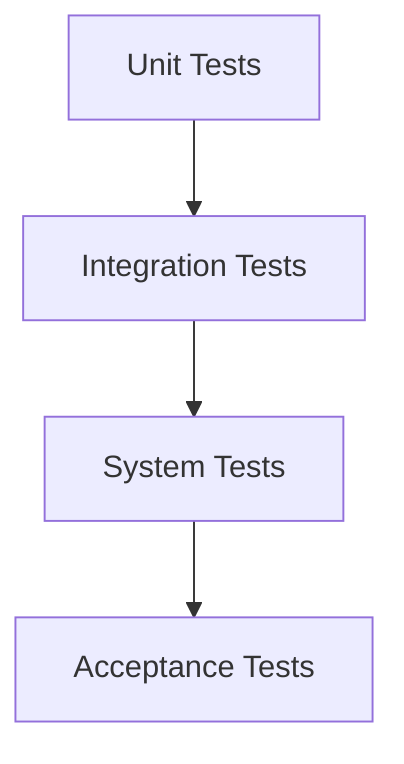

# Testing

## Estrategia de Testing



## Unit Tests (Firmware)

### Framework: Unity

Unity es un framework ligero de testing para C/C++ ideal para embedded.

**Configuración en platformio.ini:**

```ini
[env:native]
platform = native
test_framework = unity
build_flags = -DUNITY_INCLUDE_DOUBLE
```

### Estructura de Tests

```
test/
├── test_pid_controller/
│   └── test_pid.cpp
├── test_sensor_manager/
│   └── test_sensors.cpp
├── test_alarm_manager/
│   └── test_alarms.cpp
└── test_config_manager/
    └── test_config.cpp
```

### Ejemplo: Test del Controlador PID

```cpp
// test/test_pid_controller/test_pid.cpp

#include <unity.h>
#include "control/PIDController.h"

PIDController* pid;

void setUp() {
    pid = new PIDController(2.0, 0.5, 1.0);
    pid->setSetpoint(36.5);
    pid->setOutputLimits(0, 100);
}

void tearDown() {
    delete pid;
}

void test_pid_initial_output() {
    // Con error grande, debe dar salida máxima
    float output = pid->compute(25.0);  // 11.5°C por debajo
    TEST_ASSERT_GREATER_THAN(50.0, output);
}

void test_pid_at_setpoint() {
    // En el setpoint, la salida debe ser baja
    pid->compute(36.0);
    pid->compute(36.3);
    pid->compute(36.5);  // En setpoint
    float output = pid->compute(36.5);
    TEST_ASSERT_LESS_THAN(30.0, output);
}

void test_pid_output_limits() {
    // La salida nunca debe exceder los límites
    float output1 = pid->compute(20.0);  // Error muy grande
    TEST_ASSERT_LESS_OR_EQUAL(100.0, output1);
    TEST_ASSERT_GREATER_OR_EQUAL(0.0, output1);
    
    float output2 = pid->compute(40.0);  // Sobre el setpoint
    TEST_ASSERT_LESS_OR_EQUAL(100.0, output2);
    TEST_ASSERT_GREATER_OR_EQUAL(0.0, output2);
}

void test_pid_reset() {
    pid->compute(30.0);
    pid->compute(32.0);
    pid->reset();
    
    // Después de reset, el integral debe ser cero
    // Verificamos indirectamente
    float output1 = pid->compute(36.4);  // Pequeño error
    pid->reset();
    float output2 = pid->compute(36.4);  // Mismo error, sin historial
    
    TEST_ASSERT_FLOAT_WITHIN(5.0, output1, output2);
}

void test_pid_anti_windup() {
    // Simular saturación prolongada
    for (int i = 0; i < 100; i++) {
        pid->compute(25.0);  // Error grande constante
    }
    
    // Cambiar a setpoint - no debe haber overshoot excesivo
    float output = pid->compute(36.5);
    TEST_ASSERT_LESS_THAN(50.0, output);
}

int main(int argc, char **argv) {
    UNITY_BEGIN();
    
    RUN_TEST(test_pid_initial_output);
    RUN_TEST(test_pid_at_setpoint);
    RUN_TEST(test_pid_output_limits);
    RUN_TEST(test_pid_reset);
    RUN_TEST(test_pid_anti_windup);
    
    return UNITY_END();
}
```

### Ejemplo: Test del Alarm Manager

```cpp
// test/test_alarm_manager/test_alarms.cpp

#include <unity.h>
#include "alarms/AlarmManager.h"

AlarmManager* alarmManager;
AlarmConfig config;

void setUp() {
    config.tempHighWarning = 37.5;
    config.tempHighAlarm = 38.0;
    config.tempLowWarning = 34.0;
    config.tempLowAlarm = 32.0;
    
    alarmManager = new AlarmManager(config);
}

void tearDown() {
    delete alarmManager;
}

void test_no_alarm_in_normal_range() {
    SensorReadings readings;
    readings.temperature = 36.5;
    readings.humidity = 60.0;
    
    alarmManager->checkAlarms(readings);
    
    TEST_ASSERT_EQUAL(0, alarmManager->getActiveAlarmCount());
}

void test_temp_high_warning() {
    SensorReadings readings;
    readings.temperature = 37.6;  // Sobre warning, bajo alarm
    readings.humidity = 60.0;
    
    alarmManager->checkAlarms(readings);
    
    TEST_ASSERT_EQUAL(1, alarmManager->getActiveAlarmCount());
    
    auto alarms = alarmManager->getActiveAlarms();
    TEST_ASSERT_EQUAL(AlarmCode::TEMP_HIGH_WARNING, alarms[0].code);
    TEST_ASSERT_EQUAL(AlarmLevel::WARNING, alarms[0].level);
}

void test_temp_high_alarm() {
    SensorReadings readings;
    readings.temperature = 38.5;  // Sobre alarm
    readings.humidity = 60.0;
    
    alarmManager->checkAlarms(readings);
    
    auto alarms = alarmManager->getActiveAlarms();
    TEST_ASSERT_EQUAL(AlarmCode::TEMP_HIGH_ALARM, alarms[0].code);
    TEST_ASSERT_EQUAL(AlarmLevel::CRITICAL, alarms[0].level);
}

void test_alarm_acknowledge() {
    SensorReadings readings;
    readings.temperature = 38.5;
    readings.humidity = 60.0;
    
    alarmManager->checkAlarms(readings);
    
    auto alarms = alarmManager->getActiveAlarms();
    int alarmId = alarms[0].id;
    
    alarmManager->acknowledgeAlarm(alarmId);
    
    alarms = alarmManager->getActiveAlarms();
    TEST_ASSERT_TRUE(alarms[0].acknowledged);
}

void test_alarm_clears_when_condition_resolves() {
    SensorReadings readings;
    
    // Generar alarma
    readings.temperature = 38.5;
    alarmManager->checkAlarms(readings);
    TEST_ASSERT_EQUAL(1, alarmManager->getActiveAlarmCount());
    
    // Resolver condición
    readings.temperature = 36.5;
    alarmManager->checkAlarms(readings);
    TEST_ASSERT_EQUAL(0, alarmManager->getActiveAlarmCount());
}

int main(int argc, char **argv) {
    UNITY_BEGIN();
    
    RUN_TEST(test_no_alarm_in_normal_range);
    RUN_TEST(test_temp_high_warning);
    RUN_TEST(test_temp_high_alarm);
    RUN_TEST(test_alarm_acknowledge);
    RUN_TEST(test_alarm_clears_when_condition_resolves);
    
    return UNITY_END();
}
```

### Ejecutar Tests

```bash
# Ejecutar todos los tests
pio test

# Ejecutar test específico
pio test -f test_pid_controller

# Ejecutar en target específico
pio test -e native

# Con verbose
pio test -v
```

## Integration Tests

### Test de Comunicación I2C

```cpp
void test_i2c_sensor_communication() {
    Wire.begin(21, 22);
    
    // Escanear bus I2C
    byte count = 0;
    for (byte addr = 1; addr < 127; addr++) {
        Wire.beginTransmission(addr);
        if (Wire.endTransmission() == 0) {
            count++;
        }
    }
    
    // Debe encontrar al menos SHT31 y Display
    TEST_ASSERT_GREATER_OR_EQUAL(2, count);
}

void test_sensor_readings_valid() {
    SensorManager sensors;
    sensors.begin();
    
    // Dar tiempo para primera lectura
    delay(1000);
    sensors.update();
    
    float temp = sensors.getAmbientTemperature();
    float humidity = sensors.getHumidity();
    
    // Lecturas deben estar en rango razonable
    TEST_ASSERT_FLOAT_WITHIN(50.0, 25.0, temp);  // 0-50°C
    TEST_ASSERT_FLOAT_WITHIN(50.0, 50.0, humidity);  // 0-100%
}
```

## Web App Tests

### Framework: Vitest

```bash
npm install -D vitest @vue/test-utils jsdom
```

**vite.config.ts:**

```typescript
/// <reference types="vitest" />
import { defineConfig } from 'vite'
import vue from '@vitejs/plugin-vue'

export default defineConfig({
  plugins: [vue()],
  test: {
    globals: true,
    environment: 'jsdom',
  },
})
```

### Ejemplo: Test de Componente Vue

```typescript
// src/components/__tests__/TemperatureDisplay.test.ts

import { describe, it, expect } from 'vitest'
import { mount } from '@vue/test-utils'
import TemperatureDisplay from '../TemperatureDisplay.vue'

describe('TemperatureDisplay', () => {
  it('renders temperature value', () => {
    const wrapper = mount(TemperatureDisplay, {
      props: {
        temperature: 36.5,
        setpoint: 36.5
      }
    })
    
    expect(wrapper.text()).toContain('36.5')
  })
  
  it('shows warning when temperature is high', () => {
    const wrapper = mount(TemperatureDisplay, {
      props: {
        temperature: 38.0,
        setpoint: 36.5,
        warningThreshold: 37.5
      }
    })
    
    expect(wrapper.classes()).toContain('warning')
  })
  
  it('emits update event when setpoint changes', async () => {
    const wrapper = mount(TemperatureDisplay, {
      props: {
        temperature: 36.5,
        setpoint: 36.5,
        editable: true
      }
    })
    
    await wrapper.find('input').setValue('37.0')
    await wrapper.find('button').trigger('click')
    
    expect(wrapper.emitted('update:setpoint')).toBeTruthy()
    expect(wrapper.emitted('update:setpoint')[0]).toEqual([37.0])
  })
})
```

### Test de API

```typescript
// src/api/__tests__/incunest-api.test.ts

import { describe, it, expect, vi, beforeEach } from 'vitest'
import { IncuNestAPI } from '../incunest-api'

describe('IncuNestAPI', () => {
  let api: IncuNestAPI
  
  beforeEach(() => {
    api = new IncuNestAPI('http://localhost')
    vi.stubGlobal('fetch', vi.fn())
  })
  
  it('fetches sensor data', async () => {
    const mockData = {
      success: true,
      data: {
        temperature: { ambient: 36.5 },
        humidity: { current: 60.0 }
      }
    }
    
    vi.mocked(fetch).mockResolvedValue({
      ok: true,
      json: () => Promise.resolve(mockData)
    } as Response)
    
    const result = await api.getSensors()
    
    expect(fetch).toHaveBeenCalledWith('http://localhost/api/sensors')
    expect(result.data.temperature.ambient).toBe(36.5)
  })
  
  it('handles API errors', async () => {
    vi.mocked(fetch).mockResolvedValue({
      ok: false,
      status: 500
    } as Response)
    
    await expect(api.getSensors()).rejects.toThrow()
  })
})
```

### Ejecutar Tests Web

```bash
# Ejecutar tests
npm run test

# Con watch mode
npm run test -- --watch

# Con coverage
npm run test -- --coverage
```

## Continuous Integration

Ver [CI/CD](./ci-cd) para configuración de tests automatizados.

## Coverage

### PlatformIO Coverage

```ini
[env:native]
platform = native
test_framework = unity
build_flags = 
    -fprofile-arcs 
    -ftest-coverage
    --coverage
```

### Web App Coverage

```bash
npm run test -- --coverage
```

## Próximas Secciones

- [Debugging](./debugging)
- [CI/CD](./ci-cd)
